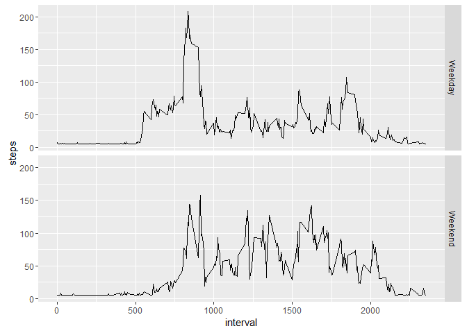

# Reproducible Research: Peer Assessment 1
Xray Wang  
February 23, 2016  


This is an R Markdown document for the Analysis of Activity Monitoring Data. 
The data is from [here](https://d396qusza40orc.cloudfront.net/repdata%2Fdata%2Factivity.zip).  

The data are the number of steps taken of an anonymous individual in 5 mins intervals each day from Oct to Nov 2012 (two months of data), collected from a personal activity monitoring device. 

The variables included in this datasets are:

* steps: Number of steps taking in a 5-minute interval (missing values as NA)
* date: The date in YYYY-MM-DD format
* interval: Identifier for each 5-minute interval

The following parts of this document will be about:

* Loading and preprocessing the data
* What is mean total number of steps taken per day?
* What is the average daily activity pattern?
* Imputing missing values
* Are there differences in activity patterns between weekdays and weekends?


## Loading and preprocessing the data

This is the code reading in all the data and from the zip file in the working directory. 
This file will try to download it to the working directory and unzip it as activity.csv.   
If a file with the same name already exists, then it will just load from the file. 


```r
csvFile <- 'activity.csv'
if(!file.exists(csvFile)){
        tempFile = tempfile()
        download.file('http://d396qusza40orc.cloudfront.net/repdata%2Fdata%2Factivity.zip', tempFile)
        unzip(tempFile, csvFile)
        file.remove(tempFile)
} 
data <- read.csv(csvFile)
```

A few commands to get the sense of what the data look like. 


```r
str(data)
```

```
## 'data.frame':	17568 obs. of  3 variables:
##  $ steps   : int  NA NA NA NA NA NA NA NA NA NA ...
##  $ date    : Factor w/ 61 levels "2012-10-01","2012-10-02",..: 1 1 1 1 1 1 1 1 1 1 ...
##  $ interval: int  0 5 10 15 20 25 30 35 40 45 ...
```

```r
head(data)
```

```
##   steps       date interval
## 1    NA 2012-10-01        0
## 2    NA 2012-10-01        5
## 3    NA 2012-10-01       10
## 4    NA 2012-10-01       15
## 5    NA 2012-10-01       20
## 6    NA 2012-10-01       25
```

## What is mean total number of steps taken per day?

For this part of the analysis, the missing values in the dataset are ignored.


```r
tidyData <- data[complete.cases(data), ]
```

Calculate the total number of steps taken per day.


```r
stepByDate <- tapply(tidyData$steps, tidyData$date, sum)
stepByDate
```

```
## 2012-10-01 2012-10-02 2012-10-03 2012-10-04 2012-10-05 2012-10-06 
##         NA        126      11352      12116      13294      15420 
## 2012-10-07 2012-10-08 2012-10-09 2012-10-10 2012-10-11 2012-10-12 
##      11015         NA      12811       9900      10304      17382 
## 2012-10-13 2012-10-14 2012-10-15 2012-10-16 2012-10-17 2012-10-18 
##      12426      15098      10139      15084      13452      10056 
## 2012-10-19 2012-10-20 2012-10-21 2012-10-22 2012-10-23 2012-10-24 
##      11829      10395       8821      13460       8918       8355 
## 2012-10-25 2012-10-26 2012-10-27 2012-10-28 2012-10-29 2012-10-30 
##       2492       6778      10119      11458       5018       9819 
## 2012-10-31 2012-11-01 2012-11-02 2012-11-03 2012-11-04 2012-11-05 
##      15414         NA      10600      10571         NA      10439 
## 2012-11-06 2012-11-07 2012-11-08 2012-11-09 2012-11-10 2012-11-11 
##       8334      12883       3219         NA         NA      12608 
## 2012-11-12 2012-11-13 2012-11-14 2012-11-15 2012-11-16 2012-11-17 
##      10765       7336         NA         41       5441      14339 
## 2012-11-18 2012-11-19 2012-11-20 2012-11-21 2012-11-22 2012-11-23 
##      15110       8841       4472      12787      20427      21194 
## 2012-11-24 2012-11-25 2012-11-26 2012-11-27 2012-11-28 2012-11-29 
##      14478      11834      11162      13646      10183       7047 
## 2012-11-30 
##         NA
```

Histogram of the total number of steps taken each day. 


```r
hist(stepByDate, breaks=10, main='Histogram of the total number of steps taken each day', xlab='Steps', col='cyan3')
```


Calculate and report the mean and median of the total number of steps taken per day.

First, mean:


```r
mean(stepByDate, na.rm=T)
```

```
## [1] 10766.19
```

Second, median:


```r
median(stepByDate, na.rm=T)
```

```
## [1] 10765
```

## What is the average daily activity pattern?

First get the average steps for each interval for all days. 


```r
stepByInterval <- tapply(tidyData$steps, tidyData$interval, mean)
stepByInterval <- data.frame(stepByInterval)
stepByInterval$interval <- row.names(stepByInterval)
names(stepByInterval)[1] = 'step'
```

Time series plot of the average number of steps taken


```r
plot(stepByInterval$interval, stepByInterval$step, type='l', ylab='Step', xlab='Interval ID')
```


Which 5-minute interval, on average across all the days in the dataset, contains the maximum number of steps?


```r
maxStepInDay <- max(stepByInterval$step)
maxIntervalIndex <- which(stepByInterval$step==maxStepInDay)
maxInterval <- stepByInterval[maxIntervalIndex,]$interval
maxInterval
```

```
## [1] "835"
```

```r
#Show it in plot
plot(stepByInterval$interval, stepByInterval$step, type='l', ylab='Step', xlab='Interval ID')
abline(v=maxInterval, lwd=2, col='blue')
```


## Imputing missing values

Calculate and report the total number of missing values in the dataset (i.e. the total number of rows with NAs).


```r
sum(!complete.cases(data))
```

```
## [1] 2304
```

Code to describe and show a strategy for imputing missing data.
Using the mean value for NA. 


```r
library(dplyr)
```

```
## 
## Attaching package: 'dplyr'
```

```
## The following objects are masked from 'package:stats':
## 
##     filter, lag
```

```
## The following objects are masked from 'package:base':
## 
##     intersect, setdiff, setequal, union
```

```r
imputedData <- data
imputedData$steps <- as.numeric(imputedData$steps)
imputedData <- mutate(imputedData, steps = ifelse(is.na(steps), round(mean(steps, na.rm = T),0), steps)) 
```

Histogram of the total number of steps taken each day after missing values are imputed. 


```r
stepByDate <- tapply(imputedData$steps, imputedData$date, sum)
stepByDate
```

```
## 2012-10-01 2012-10-02 2012-10-03 2012-10-04 2012-10-05 2012-10-06 
##      10656        126      11352      12116      13294      15420 
## 2012-10-07 2012-10-08 2012-10-09 2012-10-10 2012-10-11 2012-10-12 
##      11015      10656      12811       9900      10304      17382 
## 2012-10-13 2012-10-14 2012-10-15 2012-10-16 2012-10-17 2012-10-18 
##      12426      15098      10139      15084      13452      10056 
## 2012-10-19 2012-10-20 2012-10-21 2012-10-22 2012-10-23 2012-10-24 
##      11829      10395       8821      13460       8918       8355 
## 2012-10-25 2012-10-26 2012-10-27 2012-10-28 2012-10-29 2012-10-30 
##       2492       6778      10119      11458       5018       9819 
## 2012-10-31 2012-11-01 2012-11-02 2012-11-03 2012-11-04 2012-11-05 
##      15414      10656      10600      10571      10656      10439 
## 2012-11-06 2012-11-07 2012-11-08 2012-11-09 2012-11-10 2012-11-11 
##       8334      12883       3219      10656      10656      12608 
## 2012-11-12 2012-11-13 2012-11-14 2012-11-15 2012-11-16 2012-11-17 
##      10765       7336      10656         41       5441      14339 
## 2012-11-18 2012-11-19 2012-11-20 2012-11-21 2012-11-22 2012-11-23 
##      15110       8841       4472      12787      20427      21194 
## 2012-11-24 2012-11-25 2012-11-26 2012-11-27 2012-11-28 2012-11-29 
##      14478      11834      11162      13646      10183       7047 
## 2012-11-30 
##      10656
```

Histogram of the total number of steps taken each day. 


```r
hist(stepByDate, breaks=10, main='Histogram of the total number of steps taken each day', xlab='Steps', col='cyan3')
```


Calculate and report the mean and median of the total number of steps taken per day.

First, mean:


```r
mean(stepByDate, na.rm=T)
```

```
## [1] 10751.74
```

Second, median:


```r
median(stepByDate, na.rm=T)
```

```
## [1] 10656
```

The values are slightly different from the first part of the analysis (where the NA data are just ignored).  Filling in the total mean lowers the mean and median of daily steps (with the data on the date the report is generated). 

## Are there differences in activity patterns between weekdays and weekends?

Create a new factor variable in the dataset with two levels – “weekday” and “weekend” indicating whether a given date is a weekday or weekend day.


```r
library(lubridate)
imputedData$weekday <- wday(imputedData$date, label=T, abbr = F)
weekendDays <- c('Saturday', 'Sunday')
imputedData <- mutate(imputedData, weekend = ifelse(weekday %in% weekendDays, 'Weekend', 'Weekday'))
```


Make a panel plot containing a time series plot (i.e. type = "l") of the 5-minute interval (x-axis) and the average number of steps taken, averaged across all weekday days or weekend days (y-axis). 


```r
library(plyr)
```

```
## -------------------------------------------------------------------------
```

```
## You have loaded plyr after dplyr - this is likely to cause problems.
## If you need functions from both plyr and dplyr, please load plyr first, then dplyr:
## library(plyr); library(dplyr)
```

```
## -------------------------------------------------------------------------
```

```
## 
## Attaching package: 'plyr'
```

```
## The following object is masked from 'package:lubridate':
## 
##     here
```

```
## The following objects are masked from 'package:dplyr':
## 
##     arrange, count, desc, failwith, id, mutate, rename, summarise,
##     summarize
```

```r
library(ggplot2)

stepsByWhetherOnWeekend <- ddply(imputedData, .(weekend, interval), summarize, steps = mean(steps))
qplot(interval, steps, data = stepsByWhetherOnWeekend, geom='line', facets = weekend~.)
```



We can see clearly that in the weekdays, there is a peak of steps in the morning, and in the weekends, steps are more evenned up.  

